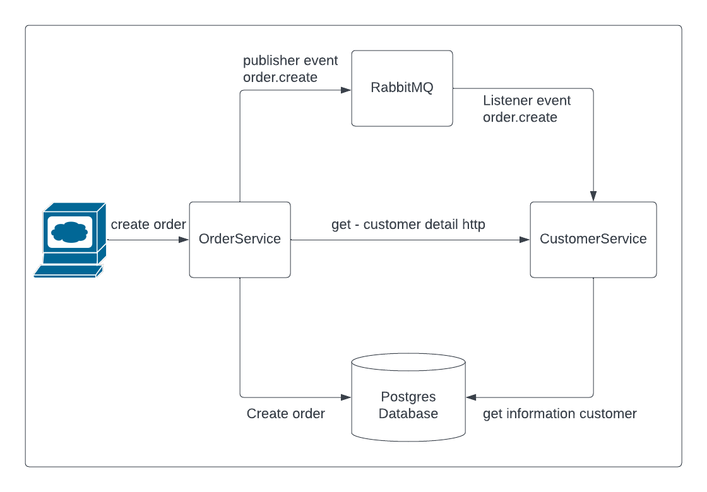

# Microservicios de Pedidos y Clientes

Este proyecto está compuesto por dos microservicios: **OrderService** y **CustomerService**. Utilizan una arquitectura **hexagonal** con `adapters` y `ports`, siguiendo principios de diseño SOLID, pruebas automatizadas y comunicación asíncrona basada en eventos con RabbitMQ.

## 🛠️ Requisitos

- Docker y Docker Compose instalados en tu máquina
- Ruby y Rails no son necesarios en local, ya que todo corre en contenedores.

## 🚀 Puesta en marcha

## 1. Clonar el repositorio

```bash
git clone https://github.com/webesteban/monokera_test.git
cd monokera_test
```

## 2. Configurar variables de entorno

```bash
cp .env.example .env
cp order_service/.env.example order_service/.env
cp customer_service/.env.example customer_service/.env
```

## 🧱 3. Ejecución

Desde la raíz del proyecto, simplemente ejecuta:

```bash
./run.sh build 
```
_comando que creara los contenedores_

```bash
./run.sh up 
```
_comando para levantar los contenedores_

```bash
./run.sh migrate 
```
_comando para crear bases de datos y correr las migraciones pertinentes_

```bash
./run.sh seed
```
_comando para generar los seed_

## Estos pasos construye y levanta ambos servicios junto con PostgreSQL y RabbitMQ.


Tambien existen otros comandos para mayor facilidad

```bash
./run.sh logs 
```
_comando para visualizar los logs de los contenedores_

```bash
./run.sh restart 
```
_comando para resetear los contenedores creados_

```bash
./run.sh down 
```
_comando para detener los contenedores_

```bash
./run.sh reset 
```
_comando para eliminar todos los contenedores_

```bash
./run.sh status 
```
_comando para visualizar el estatus de todos los contenedores_

## 🧱 4. Pruebas

Desde la raíz del proyecto, simplemente ejecuta:

```bash
./run.sh test 
```
_comando que correr las pruebas de los servicios creados_

Te sacara un informe de las pruebas realizadas y su coverage

Contamos con:

- Pruebas **unitarias** de modelos y servicios
- Pruebas de **integración** entre endpoints
- Pruebas de **eventos** para verificar la comunicación asincrónica

## Servicios

| Servicio            | URL                          |
|---------------------|------------------------------|
| RabbitMQ Dashboard  | [http://localhost:15672](http://localhost:15672) |
| Customer Service        | [http://localhost:3001](http://localhost:3001)   |
| Order Service           | [http://localhost:3000](http://localhost:3000)   |


RabbitMQ Credenciales:
- User: guest
- Password: guest

- **OrderService**
  - Puerto: `${ORDER_SERVICE_PORT}` (ej. 3000)
  - Encargado de crear pedidos, solicitar a otro microservicio informacion del cliente  y emitir eventos `order.created`.

- **CustomerService**
  - Puerto: `${CUSTOMER_SERVICE_PORT}` (ej. 3001)
  - Encargado de la informacion del cliente
  - Escucha eventos `order.created` para actualizar el contador de pedidos del cliente.

## Arquitectura

Se sigue una **arquitectura hexagonal**, separando las preocupaciones entre la lógica de negocio y los detalles de infraestructura como RabbitMQ o Faraday. Esto permite modificar estos componentes sin afectar la lógica del dominio.

- `Adapters`: Implementaciones de puertos para mensajería, eventos o HTTP
- `Ports`: Interfaces que abstraen comportamientos externos
- `Services`: Casos de uso del negocio


## Diagrama de flujo de creacion de pedido



En este diagrama podemos ver como se comunican entre los diferentes servicios y como el servicio de orders publica el evento orders.created y el CustomerService es el encargado de escuchar este evento y hacer la logica de negocio correspondiente.


## Endpoins Rest

Accede a la documentación Swagger de cada servicio:

- [http://localhost:${ORDER_SERVICE_PORT}/api-docs](http://localhost:${ORDER_SERVICE_PORT}/api-docs)
- [http://localhost:${CUSTOMER_SERVICE_PORT}/api-docs](http://localhost:${CUSTOMER_SERVICE_PORT}/api-docs)

Encontraras los diferentes Endpoinds creados para cada servicio, sus respuesta y parametros

## ⚙️ Integración con RabbitMQ

El proyecto implementa una arquitectura orientada a eventos con **RabbitMQ**, manteniendo los principios de **arquitectura hexagonal** (puertos y adaptadores) para desacoplar la lógica del dominio de la infraestructura.

### ✔ Publicador de eventos

- **Archivo**: `app/adapters/broker/rabbitmq_publisher.rb`
- **Responsabilidad**: Publicar eventos hacia un `exchange` de tipo `topic`, con soporte para durabilidad y reconexión.
- **Interfaz**: `Events::OrderEventPublisher` (Puerto)
- **Evento manejado**: `order.created`
- **Ejemplo de payload**:

```json
{
  "event": "order.created",
  "data": {
    "id": 1,
    "customer_id": 1,
    "status": "pending"
  }
}
```

### ✔ Consumidor de eventos
- **Archivo**: app/adapters/broker/rabbitmq_consumer.rb

- **Responsabilidad**: Suscribirse a una queue y procesar mensajes entrantes invocando lógica de aplicación.

- **Configuración**:
  - Usa exchange topic
  - Bind con routing_key específica
  - Consume con block: true para mantener el proceso vivo

### ✔ Listener (Adaptador de entrada)

- **Archivo**: app/listeners/orders/order_created_listener.rb
- **Responsabilidad**: Escuchar eventos del tipo order.created y delegar el procesamiento al servicio Orders::HandleCreated.

### Servicio manejador del evento

- **Archivo**: app/services/orders/handle_created.rb
- **Responsabilidad**: Actualizar el cliente al recibir un nuevo pedido.
- **Ejemplo**: Incrementar el campo orders_count de un cliente.

### ✔ Script ejecutable del listener
- **Archivo**: bin/order_created_listener

- **Contenido**:

```ruby
#!/usr/bin/env ruby
require_relative '../config/environment'

listener = Orders::OrderCreatedListener.new
listener.call
```

- **Docker Compose**: Ejecuta el script como segundo proceso en el servicio:
```yaml
command: bash -c "rm -f tmp/pids/server.pid && bundle exec rails s -b 0.0.0.0 -p 3000 & ./bin/order_created_listener"
```

**Este diseño asegura**:

- Desacoplamiento total entre lógica y tecnología (RabbitMQ, Faraday)
- Claridad de responsabilidades y extensibilidad
- Pruebas unitarias e integración limpias
- Tolerancia a errores y facilidad de debugging


